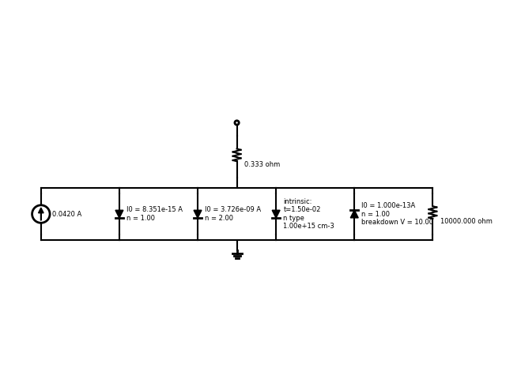
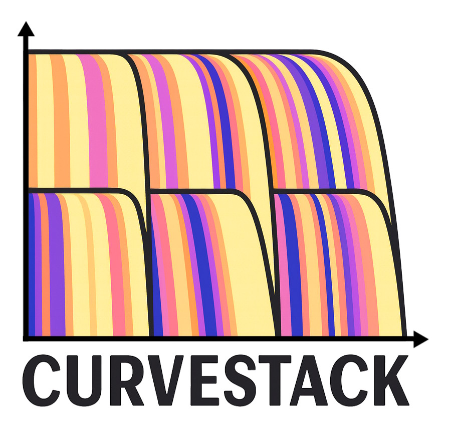

# 📦 PV Circuit Model – Overview

Solar cells are often arranged in a hierarchical network of **series and parallel connections**. Here's is an example representation of a solar cell modeled using this structure:

To simulate the I–V curve of any photovoltaic (PV) system—whether it is a single cell or a utility-scale array consisting of **over 100,000 cells**—one simply adds the **voltages of components connected in series** and the **currents of components connected in parallel**. This direct hierarchical composition approach is **orders of magnitude faster than SPICE-based simulations**, which rely on iterative Newton solvers. Moreover, the performance gap grows rapidly as circuit size increases.

**PV Circuit Model** is a Python library that implements this approach, and we refer to this hierarchical I–V composition method as **CurveStack**. CurveStack includes several useful numerical tools, such as:

- Adaptive **remeshing near a desired operating point** (e.g., maximum power point)
- Computation of **tight upper and lower bounds** on the I–V curve
- High-precision error estimation of derived I–V parameters—often reaching **10 parts-per-million accuracy**, even for very large systems

  

In addition to CurveStack, **PV Circuit Model** also provides tools to simulate and analyze standard PV measurements (e.g., I–V curves, Suns-Voc), along with workflows for **fitting circuit models to experimental data**.  It also provides built-in functionalities like the dark current due to intrinsic silicon recombination, and luminescence coupling in tandem cells, which make it convenient to do various calculations related to solar cells.

# 🛠️ Getting Started
1. Install the package in development mode: `pip install -e .`

1. Run example code
You can test the package functionality by executing the example script inside the examples/ directory:

⚙️ Platform Support & Build Requirements

## Current Support Status

✅ **Windows**: Supported (tested)
✅ **Linux**: Tested via Docker (Debian GNU/Linux 13)
⚠️ **macOS**: Not yet tested

**Python versions**: Tested on Python 3.11 and 3.12

### Build Requirements (Mandatory)

PV Circuit Model includes compiled C++/Cython extensions 
A native build toolchain must be available at installation time.
- **Windows**: Microsoft Visual C++ Build Tools (MSVC)
- **Linux**: A C/C++ compiler toolchain (e.g. `gcc`, `g++`, `make`) with OpenMP support
- **macOS**: A C/C++ compiler toolchain (e.g. Xcode Command Line Tools) will be required once macOS support is validated
Precompiled wheels are not yet provided for all platforms; building from source is currently required.

# Validation / Benchmarking

Since v0.2.0, **PV Circuit Model** calculation outputs are compared to LTspice Version (x64): 24.0.12 as part of the test plan.  See test/a05-a10 cases.  All I-V curves points agree to within 0.01% (1e-4) and the Pmax agree to within 0.001% (1e-5).

